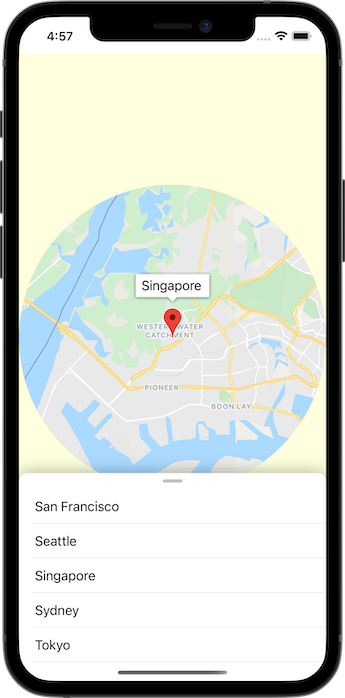

Using Maps SDK for iOS with SwiftUI
===================================

## Description
Accompanying starter and solution code for the [Add a map to your iOS app with SwiftUI (Swift)][codelab], a codelab that teaches you how to integrate the Maps SDK for iOS with SwiftUI.

## Requirements
* Xcode 11.0 or higher
* [Carthage][carthage]

[carthage]: https://github.com/Carthage/Carthage
[codelab]: https://developers.google.com/codelabs/maps-platform/maps-platform-ios-swiftui
